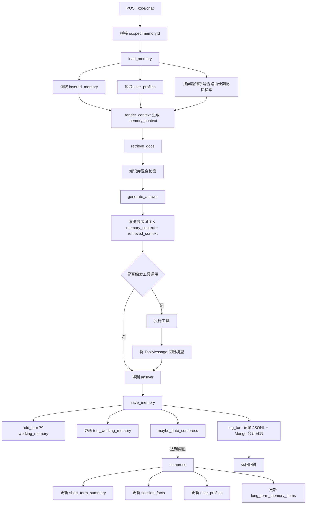
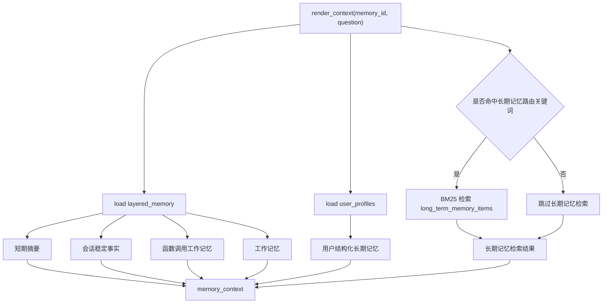
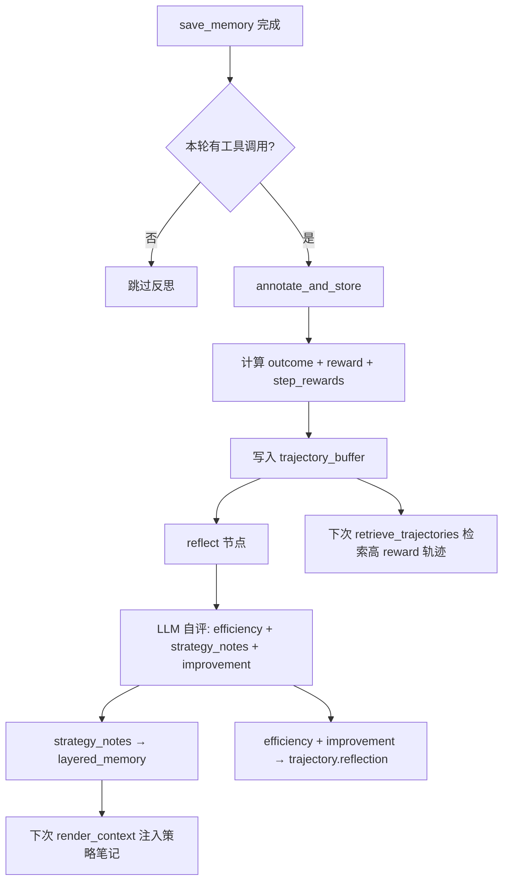
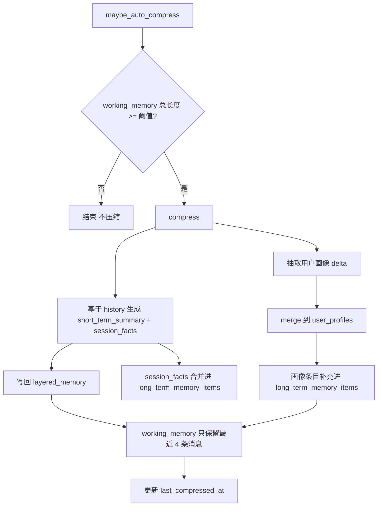

# Zoe Memory 架构说明

本文基于当前代码实现整理，重点回答 4 个问题：

1. 现在系统到底有几层 memory，各自存什么
2. 一次聊天请求从进入到结束，在哪些时间点会读取、写入、压缩 memory
3. 会话记忆、短期记忆、长期记忆、日志之间到底是什么关系
4. 每个字段是在什么时机被查询、更新、使用的

当前实现对应代码：

- 会话入口：[py-backend/app/main.py](py-backend/app/main.py)
- 图流程：[py-backend/app/agents/graph.py](py-backend/app/agents/graph.py)
- Memory 主逻辑：[py-backend/app/memory/layered_store.py](py-backend/app/memory/layered_store.py)
- 会话日志：[py-backend/app/memory/conversation_logger.py](py-backend/app/memory/conversation_logger.py)
- 主问答提示词：[py-backend/prompts/chat_system_prompt.txt](py-backend/prompts/chat_system_prompt.txt)
- 压缩提示词：[py-backend/prompts/memory_compress_prompt.txt](py-backend/prompts/memory_compress_prompt.txt)
- 用户画像抽取提示词：[py-backend/prompts/user_profile_extract_prompt.txt](py-backend/prompts/user_profile_extract_prompt.txt)

## 1. 一句话结论

当前系统不是“会话记忆”和“短期记忆”两套并列系统，而是：

- 会话级 memory 是一整套容器，按单个 memoryId 隔离
- 这个容器内部再拆成原始窗口、压缩摘要、会话事实、工具工作记忆几个部分
- 用户级长期结构记忆按 userId 隔离，跨会话复用
- 对话日志单独存，主要用于回放、排障、历史查询，不直接作为下一轮 prompt 的主输入

另外，系统还维护了一层“工具工作记忆” `tool_working_memory`，它不是普通日志字段，而是一个会跨轮次持久化的流程状态机，用来记录当前意图、已收集槽位、缺失槽位和补槽阶段。

更准确的理解应该是：

- 会话记忆 = 当前会话的一整套状态
- 短期记忆 = 会话记忆中的“近期原始窗口 + 压缩摘要”这部分能力

也就是说，短期记忆不是独立于会话记忆之外的第四层，而是会话记忆内部的一部分。

## 2. 当前实际存在的 4 类存储

### 2.1 会话级分层记忆

- 存储位置：MongoDB 集合 `zoe.layered_memory`
- 主键维度：`memory_id`
- 代码入口：[py-backend/app/memory/layered_store.py](py-backend/app/memory/layered_store.py)
- 作用：支撑“下一轮怎么答”

它保存的是当前一个会话内真正会进入模型上下文的核心状态，包含：

- `working_memory`：最近若干轮原始消息窗口
- `short_term_summary`：对更早历史做的压缩摘要
- `session_facts`：当前会话内比较稳定、后续可能复用的事实
- `strategy_notes`：Self-Reflection 节点生成的策略经验（In-Context RL）
- `tool_working_memory`：工具调用流程中的槽位、意图、缺失字段、最近工具调用状态，以及前置意图路由状态
- `last_compressed_at`：上次压缩时间

这是主 memory。下一轮问答时，系统优先读取的就是这里。

### 2.2 用户级长期结构记忆

- 存储位置：MongoDB 集合 `zoe.user_profiles`
- 主键维度：`user_id`
- 代码入口：[py-backend/app/memory/layered_store.py](py-backend/app/memory/layered_store.py)
- 作用：跨不同 memoryId 复用用户长期信息

它不是记录完整聊天过程，而是保留用户长期可复用信息，包括：

- `identity`：姓名、身份证号
- `medical_history`：病史
- `allergies`：过敏史
- `medications`：长期用药
- `preferences`：偏好
- `care_plan`：就医计划
- `long_term_memory_items`：可检索的长期记忆条目

这一层解决的是“换一个会话还能不能记住这个人”。

### 2.3 完整对话日志

- 存储位置：
  - MongoDB 集合 `zoe.conversation_sessions`
  - 本地 JSONL：`py-backend/data/logs/conversation_*.jsonl`
- 代码入口：[py-backend/app/memory/conversation_logger.py](py-backend/app/memory/conversation_logger.py)
- 作用：回放、审计、排障、会话列表查询

这一层记录的是每轮实际发生了什么，包括：

- 用户问了什么
- 模型答了什么
- 当时注入给模型的 `memory_context`
- 当时命中的检索结果 `retrieved_context`
- 本轮工具调用轨迹 `tool_trace`

这层通常不参与“下一轮 prompt 拼装”，它更像操作日志而不是思考内存。
### 2.4 轨迹缓冲区（In-Context RL）

- 存储位置：MongoDB 集合 `zoe.trajectory_buffer`
- 主键维度：无唯一键，按 `memory_id` + `created_at` 排序
- 代码入口：[py-backend/app/memory/trajectory_store.py](py-backend/app/memory/trajectory_store.py)
- 作用：存储带 reward 标注的交互轨迹，供后续检索注入

每条记录包含：

- `question`、`answer`：问答原文
- `tool_trace`：工具调用记录（含 per-step reward）
- `outcome`：交互结果分类
- `reward`：标量奖励信号
- `reflection`：Self-Reflection 节点的评估（efficiency_score、improvement）

这一层解决的是"如何从过去的经验中学习改进"。
## 3. 会话记忆和短期记忆到底有什么区别

这是最容易混淆的点。

### 3.1 当前代码里，并没有一个单独名为“短期记忆集合”的东西

当前实现里只有一个会话级 memory 文档，但里面拆成不同信息密度层次：

| 概念 | 对应字段 | 含义 |
|------|----------|------|
| 即时工作记忆 | `working_memory` | 最近几轮原始对话，保留细节 |
| 压缩短期记忆 | `short_term_summary` | 对更早对话的中文摘要 |
| 会话稳定事实 | `session_facts` | 当前会话内可复用的稳定事实 |
| 策略反思笔记 | `strategy_notes` | Self-Reflection 节点生成的策略经验 |
| 工具工作记忆 | `tool_working_memory` | 工具链路的槽位状态 + 意图路由状态 |

所以：

- `working_memory` 偏原文保留
- `short_term_summary` 偏压缩后的短期记忆
- `session_facts` 偏结构化会话事实

三者合起来才是完整的会话记忆。

### 3.2 一个更容易理解的说法

如果要给产品或文档命名，建议统一成下面这种表达：

- 会话记忆（Session Memory）
  - 近期原始窗口：`working_memory`
  - 压缩摘要：`short_term_summary`
  - 会话事实：`session_facts`
  - 策略反思笔记：`strategy_notes`
  - 工具状态：`tool_working_memory`

这样比把“会话记忆”和“短期记忆”并列写更清晰。

### 3.3 这种设计对不对

这套设计是合理的，而且很适合医疗问答 + 就医流程助手场景。

原因是：

- 只存原始消息会越来越长，prompt 成本失控
- 只存摘要会丢掉最近轮次细节，影响多轮连续交互
- 只存结构化事实又无法覆盖自然对话中的临时上下文
- 工具调用流程需要单独的槽位状态，否则用户补字段时容易断线

因此当前实现采用“原始窗口 + 摘要 + 事实 + 工具状态”的组合，是对的。

## 4. 一次聊天请求的完整触发流程

聊天入口是 `POST /zoe/chat`，请求体包含：

- `userId`
- `memoryId`
- `message`

后端会先把它拼成作用域会话 ID：

- `user_{userId}_mem_{memoryId}`

这个 scoped memoryId 会同时用于：

- 会话级记忆隔离
- 日志隔离
- 关联 userId 提取长期结构记忆

### 4.1 总流程图



### 4.2 LangGraph 节点顺序

图流程固定为：

- `load_memory`
- `retrieve_trajectories`（In-Context RL：检索相似高 reward 轨迹）
- `retrieve_docs`
- `generate_answer`
- `save_memory`
- `reflect`（Self-Reflection：仅在有工具调用时触发策略反思）

定义在 [py-backend/app/agents/graph.py](py-backend/app/agents/graph.py)。

## 5. 每个阶段具体做什么

### 5.1 load_memory

位置：[py-backend/app/agents/graph.py](py-backend/app/agents/graph.py)

这个阶段做两件事：

1. 调用 `memory_store.render_context(memory_id, question)` 生成 `memory_context`
2. 调用 `memory_store.is_first_session(memory_id)` 判断是否首次会话

在进入主 LLM 之前，`py-backend/app/agents/intent_policy.py` 还会基于 `tool_working_memory` 做前置意图路由：

1. 先读取上一轮状态（`intent`、`status`、`collected_fields`）
2. 再结合当前话术、最近工作记忆和受限路由模型判断是否继续当前流程
3. 如果缺槽位，直接返回固定追问，并把最新状态持久化回 memory
4. 如果是短闲聊（如“谢谢”“好的”）：活跃流程中保持状态不变，空闲流程回到 `idle`

其中 `render_context` 内部会：

1. 从 `layered_memory` 读取当前会话文档
2. 从 `user_profiles` 读取当前用户长期结构记忆
3. 根据当前问题判断要不要触发长期记忆路由检索
4. 把上述内容拼成一段纯文本 `memory_context`

### 5.2 retrieve_docs

位置：[py-backend/app/agents/graph.py](py-backend/app/agents/graph.py)

调用混合检索器查知识库，并将结果拼成：

- `[来源]{source}`
- 文档正文内容

最终组成 `retrieved_context`。

### 5.3 generate_answer

位置：[py-backend/app/agents/graph.py](py-backend/app/agents/graph.py)

这个阶段会把下面内容一起交给模型：

- 系统提示词模板：[py-backend/prompts/chat_system_prompt.txt](py-backend/prompts/chat_system_prompt.txt)
- 当前日期
- 是否首次会话
- `memory_context`
- `retrieved_context`
- 用户本轮问题

如果模型支持 function calling，还会进入一个最多 4 轮的工具调用循环：

1. 模型判断是否要调用工具
2. 后端执行工具
3. 工具结果被封装成 `ToolMessage`
4. 回喂给模型继续推理
5. 所有工具调用都会累积到 `tool_trace`

注意：如果前置意图路由已经判断“当前仍处于某个就医流程，但槽位不全”，这里会在真正进入主生成前短路返回追问，不会把这个问题交给大模型重新组织一遍。

### 5.4 save_memory

位置：[py-backend/app/agents/graph.py](py-backend/app/agents/graph.py)

这个阶段分三步：

1. `add_turn`：写入本轮问答到 `working_memory`
2. `maybe_auto_compress`：按阈值决定是否压缩
3. `log_turn`：将完整过程写入会话日志

同时，`tool_working_memory` 也会随着 `add_turn(...)` 一起更新，常见字段包括：

- `intent`：当前就医流程意图
- `required_fields`：该流程所需必填字段
- `collected_fields`：已收集字段
- `missing_fields`：尚未补齐字段
- `status`：`idle` / `collecting_slots` / `ready` / `tool_called`
- `last_tool_calls`：最近几次工具调用

## 6. 模型每轮到底看到什么 memory

下一轮回答时，真正进入系统提示词的是 `memory_context`，它由 [py-backend/app/memory/layered_store.py](py-backend/app/memory/layered_store.py) 中的 `render_context` 拼装。

它固定包含 7 个区块，顺序如下：

1. `[短期摘要]`
2. `[会话稳定事实]`
3. `[策略反思笔记]`（In-Context RL：Self-Reflection 节点生成的策略经验）
4. `[函数调用工作记忆]`
5. `[长期记忆检索结果]`
6. `[用户结构化长期记忆]`
7. `[工作记忆]`

此外，系统提示词中还注入了 `[历史成功轨迹参考]` 区块（由 `retrieve_trajectories` 节点从 `trajectory_buffer` 中检索填充）。

也就是说，模型拿到的不是数据库原文，而是一个已经组织好的文本上下文。

此外，`tool_working_memory` 不仅影响上下文拼装，还影响下一轮的前置路由：即使用户没有再说“预约/挂号”这些关键词，只要上一轮已经进入对应流程，系统也会优先把它识别成同一个 intent。

### 6.1 render_context 结构图



## 7. In-Context RL：轨迹标注、回放与策略反思

### 7.1 概述

系统内置了一套不依赖模型权重更新的 In-Context RL 闭环。核心思路：通过在 prompt 中注入历史成功经验来持续改进工具调用策略。

相关代码：

- 轨迹存储：[py-backend/app/memory/trajectory_store.py](py-backend/app/memory/trajectory_store.py)
- 反思提示词：[py-backend/prompts/reflection_prompt.txt](py-backend/prompts/reflection_prompt.txt)
- 策略笔记字段：`layered_memory.strategy_notes`

### 7.2 Reward-Annotated Experience Replay

每轮交互结束后，`save_memory` 阶段调用 `TrajectoryStore.annotate_and_store()`：

1. **Outcome 分类**：根据工具返回内容中的关键词分为 `success` / `failure` / `partial` / `retry_success` / `no_tool`
2. **Reward 计算**：基于 outcome 的 base reward + 效率奖励（工具调用越少奖励越高）
3. **Per-step Rewards**：每个工具调用独立打分，标注当步的 `step_outcome` 和 `step_reward`
4. **存储**：完整轨迹写入 MongoDB `zoe.trajectory_buffer`

下次聊天时，`retrieve_trajectories` 节点从 `trajectory_buffer` 中 BM25 检索 top-2 高 reward 轨迹，渲染成参考文本注入系统提示词的 `[历史成功轨迹参考]` 区块。

### 7.3 Self-Reflection Node

`save_memory` 之后执行 `reflect` 节点（仅在有工具调用时触发）：

1. 用 `reflection_prompt.txt` 调用 LLM，输入当前 question、answer、tool_trace、outcome、reward
2. LLM 输出 JSON：`efficiency_score`（1-5）、`strategy_notes`（策略经验数组）、`improvement`（改进建议）
3. `strategy_notes` 写入 `layered_memory.strategy_notes`，下次 `render_context()` 自动注入 `[策略反思笔记]` 区块
4. `efficiency_score` 和 `improvement` 附加到对应轨迹记录的 `reflection` 字段

### 7.4 流程图



### 7.5 数据结构

`trajectory_buffer` 文档结构：

```json
{
  "memory_id": "user_1_mem_123",
  "user_id": 1,
  "question": "帮我挂神经内科明天上午的号",
  "answer": "已为您预约...",
  "tool_trace": [
    {
      "tool": "book_appointment",
      "args": {"department": "神经内科"},
      "result_snippet": "预约成功！",
      "step_reward": 1.0,
      "step_outcome": "success"
    }
  ],
  "tool_count": 1,
  "outcome": "success",
  "reward": 1.0,
  "step_rewards": [{"tool": "book_appointment", "step_outcome": "success", "step_reward": 1.0}],
  "reflection": {
    "efficiency_score": 5,
    "improvement": "",
    "reflected_at": "2026-03-31T14:00:00"
  },
  "created_at": "2026-03-31T14:00:00"
}
```

`layered_memory.strategy_notes` 示例：

```json
["用户已给出科室时无需调用recommend_department", "查号源前应确认日期格式"]
```

### 7.6 `tool_working_memory` 的状态机语义

`tool_working_memory` 现在是这套记忆里最关键的流程状态字段之一，它会在前置意图路由和 `add_turn(...)` 时持续更新。

常见状态含义：

- `collecting_slots`：已经识别到流程，但必填字段还没收齐
- `ready`：槽位已收齐，下一步可以进入工具调用
- `tool_called`：本轮已经完成过一次工具调用，后续还可继续沿用同一流程
- `idle`：当前不处于活跃流程

短闲聊处理语义：

- 若当前处于活跃流程（如 `collecting_slots`），用户发送“谢谢/好的/嗯”不会打断意图状态。
- 若当前不处于活跃流程，短闲聊会把状态保持/重置为 `idle`。

这意味着，系统不再只依赖关键词重新判断“你现在在做什么”，而是把“当前流程状态”显式存下来。

## 8. 自动压缩是怎么触发的

### 8.1 触发时机

每轮回答结束后，在 `save_memory` 阶段调用：

- `maybe_auto_compress(memory_id)`

### 8.2 触发条件

它会把当前 `working_memory` 展平后计算总文本长度，如果达到阈值：

- 配置项：`AUTO_COMPRESS_TRIGGER_CHARS`
- 默认值：2200

定义在 [py-backend/app/core/config.py](py-backend/app/core/config.py)。

### 8.3 压缩时做了什么

压缩逻辑在 [py-backend/app/memory/layered_store.py](py-backend/app/memory/layered_store.py) 的 `compress` 中，顺序如下：

1. 把 `working_memory` 展平成 `history`
2. 用 [py-backend/prompts/memory_compress_prompt.txt](py-backend/prompts/memory_compress_prompt.txt) 调模型
3. 解析模型返回的 JSON
4. 更新 `short_term_summary`
5. 更新 `session_facts`
6. 把 `session_facts` 合并进 `long_term_memory_items`
7. 用 [py-backend/prompts/user_profile_extract_prompt.txt](py-backend/prompts/user_profile_extract_prompt.txt) 抽取用户画像增量
8. 更新 `user_profiles`
9. 将画像增量也合并进 `long_term_memory_items`
10. 只保留最近 2 轮到 `working_memory`
11. 更新 `last_compressed_at`

### 8.4 压缩流程图



## 9. 长期记忆什么时候查，什么时候写

### 9.1 长期记忆查询时机

长期记忆不是每轮都全量塞给模型，而是分两种方式参与。

#### 方式 A：用户结构化长期记忆

每次 `render_context` 都会查 `user_profiles`，并把用户画像转成文本放进：

- `[用户结构化长期记忆]`

这部分是固定可见的。

#### 方式 B：高 reward 轨迹检索（In-Context RL）

每轮都会执行 `retrieve_trajectories` 节点，从 `trajectory_buffer` 中 BM25 检索 top-2 相似且 reward >= 0.5 的轨迹，注入系统提示词的 `[历史成功轨迹参考]` 区块。

#### 方式 C：长期记忆条目检索

只有当前问题命中长期记忆路由关键词时，才会在 `long_term_memory_items` 上做 BM25 检索，结果放进：

- `[长期记忆检索结果]`

当前命中的关键词包括：

- `之前`
- `上次`
- `还记得`
- `历史`
- `长期`
- `继续`
- `复诊`
- `过敏`
- `慢病`
- `我的信息`
- `我的情况`
- `按之前`

实现位置：[py-backend/app/memory/layered_store.py](py-backend/app/memory/layered_store.py)。

### 9.2 长期记忆写入时机

长期记忆条目不是每轮都写，而是在压缩时写入：

1. `session_facts` 会合并进 `long_term_memory_items`
2. 用户画像抽取出来的病史、过敏史、偏好等也会合并进 `long_term_memory_items`

所以长期记忆是“压缩后沉淀”的，而不是“每轮即时写”。

这也是合理的，因为长期记忆应该尽量稳定，避免把临时噪音过早写进去。

## 9. 日志层为什么基本不用动

你的理解是对的。

日志层的职责主要是：

- 留痕
- 回放
- 排障
- 支撑历史会话接口

它不是主推理 memory，所以通常不用频繁优化结构，除非你要做：

- 会话列表/详情接口增强
- 审计字段增强
- 查询性能优化
- 日志清理归档策略

在当前架构下，日志层保持“尽量完整地记录发生了什么”就够了。

## 10. 字段生命周期总表

### 10.1 layered_memory

| 字段 | 存储层 | 写入时机 | 查询时机 | 用途 |
|------|--------|----------|----------|------|
| `working_memory` | 会话级 | 每轮 `add_turn` | 每轮 `render_context` | 保留最近几轮原始细节 |
| `short_term_summary` | 会话级 | `compress` | 每轮 `render_context` | 提供压缩后的近期背景 |
| `session_facts` | 会话级 | `compress` | 每轮 `render_context` | 提供会话内稳定事实 |
| `tool_working_memory` | 会话级 | 每轮 `add_turn` | 每轮 `render_context` | 支撑工具流程连续性 |
| `last_compressed_at` | 会话级 | `compress` | 一般不进 prompt | 标记上次压缩时间 |

### 10.2 user_profiles

| 字段 | 存储层 | 写入时机 | 查询时机 | 用途 |
|------|--------|----------|----------|------|
| `identity` | 用户级 | `compress` 中画像抽取后 | 每轮 `render_context` | 跨会话复用身份信息 |
| `medical_history` | 用户级 | `compress` | 每轮 `render_context` | 病史长期保留 |
| `allergies` | 用户级 | `compress` | 每轮 `render_context` | 过敏信息长期保留 |
| `medications` | 用户级 | `compress` | 每轮 `render_context` | 长期用药长期保留 |
| `preferences` | 用户级 | `compress` | 每轮 `render_context` | 偏好长期保留 |
| `care_plan` | 用户级 | `compress` | 每轮 `render_context` | 就医计划长期保留 |
| `long_term_memory_items` | 用户级 | `compress` | 命中路由时检索 | 作为长期条目库 |

### 10.3 会话日志

| 字段 | 存储层 | 写入时机 | 查询时机 | 用途 |
|------|--------|----------|----------|------|
| `question` | 日志层 | 每轮 `log_turn` | 回放/排障 | 保存用户输入 |
| `answer` | 日志层 | 每轮 `log_turn` | 回放/排障 | 保存模型输出 |
| `memory_context` | 日志层 | 每轮 `log_turn` | 回放/排障 | 记录当轮注入的记忆快照 |
| `retrieved_context` | 日志层 | 每轮 `log_turn` | 回放/排障 | 记录当轮检索快照 |
| `tool_trace` | 日志层 | 每轮 `log_turn` | 回放/排障 | 记录工具调用轨迹 |

## 11. 当前设计是否合理

结论：当前设计整体是合理的，不需要推翻。

### 11.1 合理点

- 会话级与用户级做了明确隔离
- 会话内同时保留原始窗口和压缩摘要，兼顾细节与成本
- 工具调用状态被单独建模，适合预约、取消、查号源这类槽位任务
- 前置意图路由依赖可持久化状态，而不是只看关键词，能保证多轮补槽连续性
- 长期记忆只在压缩后沉淀，避免把噪音过早写入长期层
- 日志层和推理 memory 解耦，职责清晰

### 11.2 需要统一的命名认知

真正要修正的不是代码，而是术语。

建议你以后统一这样说：

- 会话记忆：指 `layered_memory` 整体
- 短期记忆：指会话记忆里用于承接最近上下文的部分，主要是 `working_memory + short_term_summary`
- 长期结构记忆：指 `user_profiles`
- 对话日志：指 `conversation_sessions + JSONL`

只要术语统一，整个设计就会好懂很多。

## 12. 如果后面要继续完善，建议优先做什么

当前不是必须改，但后续可以考虑这几项增强。

### 12.1 给 session_facts 增加来源或置信度

现在 `session_facts` 只是字符串数组。如果后续要做更强可解释性，可以扩展为对象，例如：

- `text`
- `source`
- `confidence`
- `updated_at`

### 12.2 给 long_term_memory_items 增加类别标签

现在长期记忆条目主要是纯文本。如果后续要提升检索精度，可以增加：

- `category`，例如 `allergy`、`history`、`identity`、`preference`

### 12.3 调整长期记忆路由规则

目前是关键词路由，简单有效，但后续可升级为：

- 关键词 + 轻量分类器
- 或由模型判断是否需要长期记忆检索

### 12.4 为日志层增加归档策略

如果会话量上来，JSONL 和 Mongo 会话日志都可能持续增长，后续可以做：

- 历史会话归档
- 冷热分层
- JSONL 清理策略

## 13. 推荐的阅读顺序

如果要重新理解当前实现，建议按下面顺序看代码：

1. [py-backend/app/agents/graph.py](py-backend/app/agents/graph.py)
2. [py-backend/app/memory/layered_store.py](py-backend/app/memory/layered_store.py)
3. [py-backend/app/memory/conversation_logger.py](py-backend/app/memory/conversation_logger.py)
4. [py-backend/prompts/chat_system_prompt.txt](py-backend/prompts/chat_system_prompt.txt)
5. [py-backend/prompts/memory_compress_prompt.txt](py-backend/prompts/memory_compress_prompt.txt)

按这个顺序最容易把“主流程、memory 生成、压缩、日志”串起来。