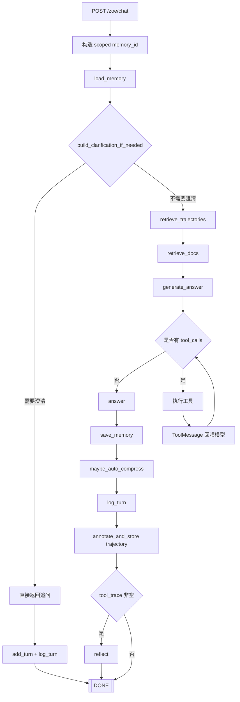
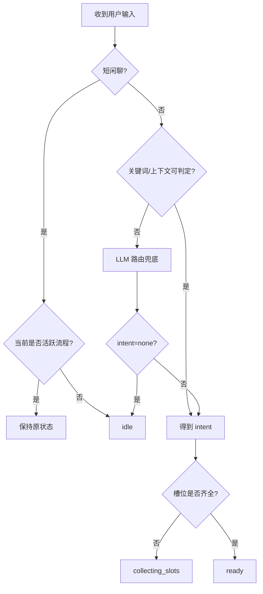
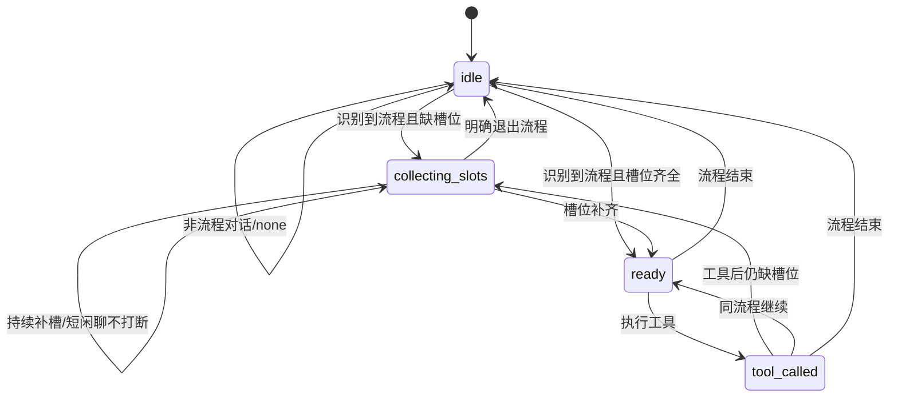

# Zoe Chat Workflow

本文聚焦 `ZoeGraph` 的执行流程，覆盖同步/流式聊天路径、前置意图路由与澄清、工具调用循环、记忆写入与反思阶段。

## 1. 相关代码位置

- 图编排与主流程：`py-backend/app/agents/graph.py`
- 前置意图路由、槽位状态维护与追问策略：`py-backend/app/agents/intent_policy.py`
- 会话记忆读写：`py-backend/app/memory/layered_store.py`
- 会话日志：`py-backend/app/memory/conversation_logger.py`
- 轨迹存储与反思标注：`py-backend/app/memory/trajectory_store.py`
- 主系统提示词：`py-backend/prompts/chat_system_prompt.txt`

## 2. 一句话概览

每轮聊天会先加载记忆，然后在调用主 LLM 前执行“前置意图路由 + 澄清策略”：先根据最近上下文、上一轮工具状态和当前话术判断用户正在做什么，再决定是否需要追问补槽；如果仍然无法确定，再交给受限的意图路由模型兜底。对于“谢谢/好的/嗯”这类短闲聊，系统会优先保持会话自然流转，不强制触发补槽位追问。

## 3. 主流程图（含前置澄清）

## 4. LangGraph 节点顺序

`graph.invoke(...)` 的固定节点顺序是：

1. `load_memory`
2. `retrieve_trajectories`
3. `retrieve_docs`
4. `generate_answer`
5. `save_memory`
6. `reflect`

说明：

- `reflect` 节点内部只在有工具调用时做实际反思。
- 流式接口 `run_stream(...)` 也通过 `graph.invoke(...)` 执行同一套节点流程，仅在 `generate_answer` 节点内通过回调发出 SSE token。

## 5. 前置意图澄清策略

执行入口：`build_clarification_if_needed(memory_store, memory_id, question)`。

### 5.1 触发条件

1. 用户问题为空：直接追问用户想做的流程类型。
2. 同时命中多个流程意图（且不存在可继承的上一轮 intent）：先让用户确认流程。
3. 当前话术没有明显关键词，但最近上下文已经在某个就医流程中：会先尝试继承上一轮 intent，再结合短回复判断是否继续补槽。
4. 已识别流程但必填字段未收齐：先追问缺失字段，再继续。
5. 上一轮处于 `collecting_slots/ready/tool_called`：即使本轮只回复字段值（如身份证号、上午/下午），也会沿用上一轮 intent 继续补槽。
6. 若用户仅发送短闲聊（如“谢谢”“好的”）：
  - 当前处于活跃流程时，不会清空 intent，也不会立刻追问槽位（避免打断对话节奏）。
  - 当前不在活跃流程时，会保持/回到 `idle`。

### 5.2 当前支持的流程意图

- `recommend_department`
- `check_registration_slots`
- `book_appointment`
- `cancel_appointment`
- `query_appointment_records`

### 5.3 槽位缺失追问示例

当用户说“帮我挂号”但未给身份证号/日期/时段时，系统会返回“还需要补充哪些字段”的追问，不会直接触发工具。

### 5.4 意图识别状态机

下面改成两张简化图：

1. 路由判定（中间逻辑）
2. 持久化状态机（真正写入 `tool_working_memory.status`）

补充说明：

- 中间态（如多意图确认）属于路由逻辑，不落库。
- 持久化状态仅关注 `idle / collecting_slots / ready / tool_called`。

## 6. 工具调用循环

在 `generate_answer` 阶段：

1. 使用 `tool_enabled_llm`（若模型支持 `bind_tools`）进行推理。
2. 最多循环 `max_rounds = 4`。
3. 每次有 `tool_calls` 时逐个执行工具，并将结果组装为 `ToolMessage` 回喂模型。
4. 无 `tool_calls` 时收敛为最终回答。

## 7. 记忆与日志写入时机

正常回答路径下：

1. `add_turn(...)`：写入工作记忆与工具工作记忆。
2. `maybe_auto_compress(...)`：达到阈值时触发压缩，更新摘要与会话事实。
3. `log_turn(...)`：写 JSONL + Mongo 会话日志。
4. `annotate_and_store(...)`：写轨迹缓冲区，供后续经验检索。

前置澄清路径下：

- 同样会执行 `add_turn(...)` 和 `log_turn(...)`，保证追问本身也进入会话上下文。
- `tool_working_memory` 也会被更新并持久化，确保下一轮即使没有关键词，也能继续沿用同一个意图状态。

## 8. 同步与流式差异

- `run(...)`：调用 `graph.invoke(...)`，一次性返回完整 answer。
- `run_stream(...)`：后台线程调用 `graph.invoke(...)`，前台以 SSE 分片输出 token，结束时输出 `data: [DONE]`。
- 两者都在 LLM 主流程前执行前置澄清策略；若命中澄清，都会短路返回追问。

## 9. 维护建议

1. 规则迭代优先改 `intent_policy.py`，避免污染编排层。
2. 新增流程意图时，同步更新：关键词、必填字段、字段文案、前置路由提示词。
3. 推荐为 `intent_policy.py` 增加单元测试，覆盖：
   - 多意图冲突
   - 上下文继承 intent
   - 纯槽位回复续流程
   - 缺失字段追问文案
  - 无关键词但有上下文时的意图路由
  - 短闲聊在活跃流程中不打断状态
